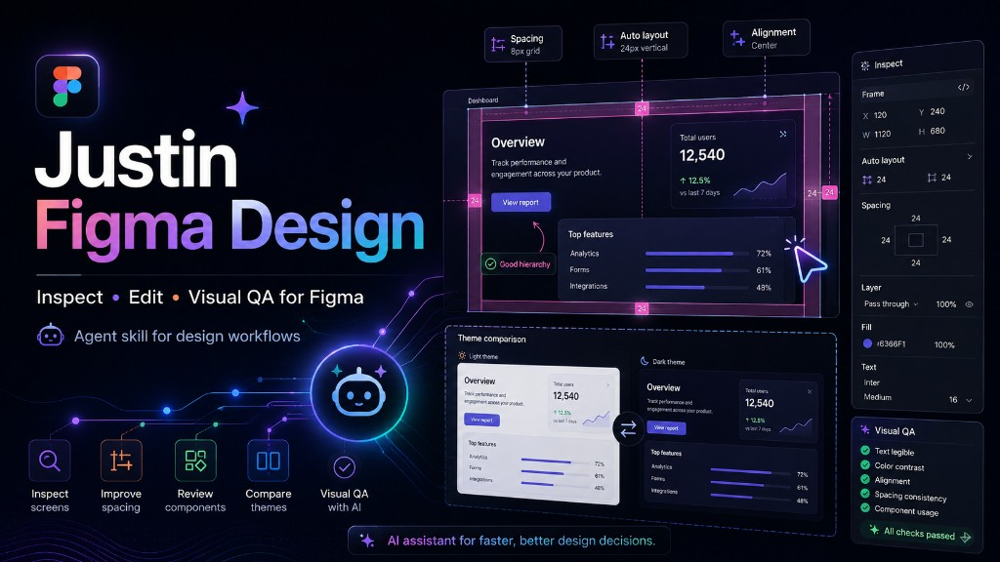
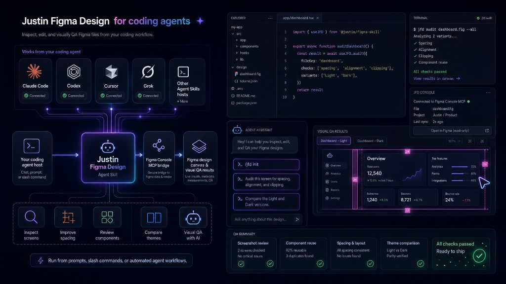

# Justin Figma Design

`justin-figma-design` helps your AI work with Figma: inspect screens, improve
spacing, review components, check themes, and visually QA the result. It is
agent-agnostic and works with any Agent Skills-compatible AI app, including
Cursor, Claude Code, Codex, and others. You can also call it `/jfd`.



> ⚠️ **Required for real Figma work:**
> [Figma Console MCP](https://github.com/southleft/figma-console-mcp) is the
> bridge between your AI app and Figma. This skill is the recipe; Console MCP
> is what lets the AI see and edit the canvas.

## What you need

- 🤖 An AI app that supports Agent Skills
- 🎨 Figma Desktop
- 🔌 **Required:** [Figma Console MCP](https://github.com/southleft/figma-console-mcp)
- 📦 **Optional:** [Node.js LTS](https://nodejs.org/en/download/) for the one-line `npx` install

The local MCP server and **Desktop Bridge** are required for Figma edits and
screenshots. The hosted or remote connection is for looking and investigating
only.



## Install the skill

### Recommended: one-line install

Open Terminal and paste:

```bash
npx skills add 1955m/justin-figma-design
```

When asked which AI app to use, choose the one you work with. You can install
the skill for all supported apps if the installer offers that choice. To make
it available across projects, use:

```bash
npx skills add 1955m/justin-figma-design --global
```

You can also install from the full GitHub URL:

```bash
npx skills add https://github.com/1955m/justin-figma-design
```

### Manual install: no command line

1. Open the repository on
   [GitHub](https://github.com/1955m/justin-figma-design).
2. Choose **Code → Download ZIP**, then unzip the download.
3. Copy the skill folder into the portable skills location:

   ```text
   .agents/skills/justin-figma-design/
   ```

   Some AI apps use their own folder, such as `.cursor/skills/` or
   `.claude/skills/`. Follow your app's skill-install instructions if needed.
4. Restart or reload your AI app.

Manual copying is useful when you do not want to install Node.js.

## Connect Figma

1. Install or enable
   [Figma Console MCP](https://github.com/southleft/figma-console-mcp) for
   your AI app.
2. Open the Figma file you want to work on in **Figma Desktop**.
3. Start the local/NPX MCP server and connect its **Desktop Bridge** to the
   open file. Follow the current setup instructions in the Console MCP
   repository.
4. Return to your AI app and confirm that the target Figma file is active.

## Start your first session

1. Open your design project folder in your AI app.
2. In the chat, type:

   ```text
   jfd init
   ```

   You can use `/jfd init` if slash commands are supported. This creates the
   project's `docs/` memory files and does not change anything in Figma.
3. Paste your Figma link or identify the open file.
4. Describe the design task in plain language.

Try prompts like:

```text
Audit this screen for spacing, alignment, and clipping.
```

```text
Compare the Light and Dark versions and fix the inconsistent component state.
```

```text
Review this flow first and create a read-only design baseline before editing.
```

## What to expect

- 👀 The AI inspects the current Figma file before changing it.
- 🧩 It reuses existing components, styles, and design-system patterns.
- 📸 It checks visual changes with screenshots.
- 📝 It keeps project-specific notes in `docs/`, separate from the reusable
  skill instructions.

## Package contents

```text
justin-figma-design/
├── SKILL.md       # Core instructions for the AI
├── references/    # Detailed workflow and QA guidance
├── scripts/       # Workspace initialization helper
├── assets/        # Templates and graphics guidance
└── examples/      # Example operating scenarios
```

For detailed setup and first-session guidance, see
[references/getting-started.md](references/getting-started.md).
